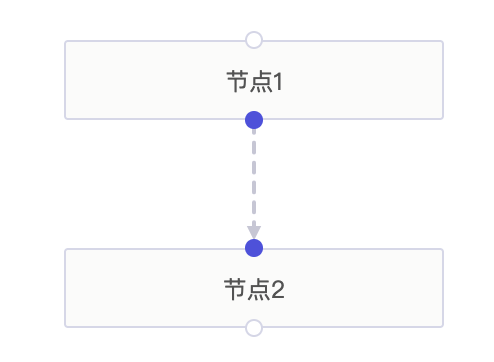

#### step1：创建容器

在页面中创建一个容器，用来渲染画布内容。如下：

```html
<div id="container"></div>
```

#### step2：准备数据

准备渲染数据，数据包括 nodes 和 edges 两个字段。 格式如下：

```javascript
const data = {
  nodes: [
    {
      id: 1, // 节点 id，唯一标识，（可选字段，默认自动生成）。
      label: '节点1', // 节点标签
      x: 500, // 节点横坐标
      y: 176 // 节点纵坐标
    },
    {
      id: 2,
      label: '节点2',
      x: 500,
      y: 280
    }
  ],
  edges: [
    {
      fromNodeId: 1, // 边的起始节点
      toNodeId: 2 // 边的目标节点
    }
  ]
}
```

#### step3：实例化 Graph

1. 首先，示例化一个 Graph 的实例，并传入一些初始化的参数。

```javascript
import { Graph } from '@datafe/graph-core'
// 使用 CDN 引入 Graph 为全局变量

const graph = new Graph({
  // 传入容器元素
  container: document.getElementById('container'),
  // 节点宽高信息
  nodeInfo: {
    width: 190,
    height: 40
  },
  // 默认交互
  action: ['drag-node', 'drag-blank', 'wheel-zoom', 'wheel-move', 'click-select']
})
```

2. 实例化后，通过 data 方法来渲染数据。

```javascript
graph.data(data)
```

3. 到此，我们就实现了一个最简单的示例，效果如下：

   

#### 附完整示例代码：

```html
<!DOCTYPE html>
<html lang="en">
  <head>
    <meta charset="UTF-8" />
    <meta name="viewport" content="width=device-width, initial-scale=1.0" />
    <title>快速入门</title>
    <style>
      html,
      body {
        padding: 0;
        margin: 0;
        height: 100%;
      }

      #container {
        height: 100%;
        width: 100%;
      }
    </style>
  </head>

  <body>
    <div id="container"></div>
  </body>
  <script src="https://s3plus.meituan.net/v1/mss_55f8d9a6b05d4008ae93823a3e424f50/graph-core/0.3.1/core.min.js"></script>
  <script>
    window.onload = function() {
      const data = {
        nodes: [
          {
            id: 1,
            label: '节点1',
            x: 500,
            y: 176
          },
          {
            id: 2,
            label: '节点2',
            x: 500,
            y: 280
          }
        ],
        edges: [
          {
            fromNodeId: 1,
            toNodeId: 2
          }
        ]
      }

      const graph = new Graph({
        container: document.getElementById('container'),
        nodeInfo: {
          width: 190,
          height: 40
        },
        action: [
          'drag-node',
          'drag-blank',
          'wheel-zoom',
          'wheel-move',
          'click-select'
        ]
      })

      graph.data(data)
    }
  </script>
</html>
```
